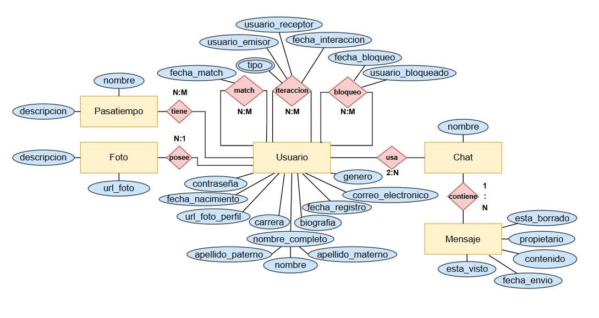
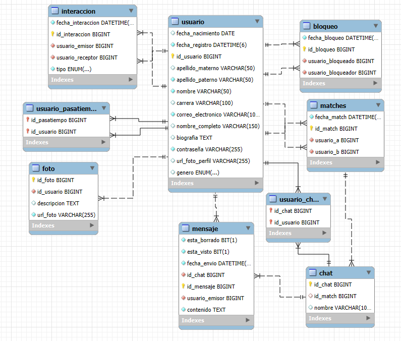

# App de Citas "HiChat"

<h3>
Los estudiantes universitarios suelen enfrentar dificultades para integrarse
socialmente y conectar con compañeros que compartan intereses comunes.
Aunque existen actividades extracurriculares y eventos dentro del campus, muchas
veces los alumnos no logran encontrar fácilmente personas con las que puedan
compartir pasatiempos, estudiar en conjunto o simplemente socializar.
</h3>

 <h2>INFORMACION DEL PROYECTO </h2> 

  
En el <b> Instituto Tecnológico de Sonora (ITSON) </b> surge la necesidad de una
herramienta que facilite la <b> búsqueda y conexión entre estudiantes </b> a partir de sus
<b> gustos, hobbies y afinidades personales </b>, promoviendo la creación de amistades,
grupos de estudio y redes de apoyo.
 

Una aplicación de escritorio desarrollada en Java SE con GUI y JPA/Hibernate permitirá a los alumnos:
 

 - Registrar su perfil personal, incluyendo sus hobbies e intereses.
 - Explorar perfiles de otros estudiantes y decidir si desean conectar con ellos.
 - Utilizar un sistema de “Me gusta” / “No me interesa” para expresar afinidad.
 - Generar un “Match” cuando dos estudiantes se muestran interés mutuo.
 - Tener la posibilidad de acceder a un módulo de chat, disponible únicamente entre estudiantes que han hecho match.

 
De esta manera, se fomentará un <b> ambiente de integración universitaria</b>,
fortaleciendo el sentido de comunidad dentro del ITSON y mejorando la experiencia
social y académica de los estudiantes.

----- 

 <h2> PANTALLAS DEL PROGRAMA </h2> 

-----

 <h2> DIAGRAMA ENTIDAD RELACION Y SQL </h2> 

 

